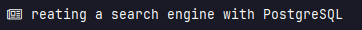

# Polybar-news

A module to display the latest news on Polybar and i3blocks from multiple sources.



## Table of Contents
- [Polybar-news](#polybar-news)
  - [Table of Contents](#table-of-contents)
  - [Dependencies](#dependencies)
  - [Setup Instructions](#setup-instructions)
  - [Contributing](#contributing)
  - [License](#license)


## Dependencies

- [requests](https://pypi.org/project/requests/) - Python requests
- [zscroll](https://github.com/noctuid/zscroll#installation) - For Polybar text scrolling *(optional)*
- [scroll](https://github.com/Anachron/i3blocks/blob/master/blocks/scroll) - For i3blocks text scrolling *(optional)*

## Setup Instructions

1. Clone the repository
2. Set up a Python environment and install dependencies *(optional but recommended)*

    ```bash
    # Create the environment
    python -m venv /path/to/environment

    # Activate the environment
    source /path/to/environment/bin/activate

    # Install the dependencies
    pip install requests
    ```
    ##### *Note: If you don't want to use a Python virtual environment, you can install the dependencies globally with pip install requests, but be aware this might conflict with other Python software on your system.<br><br>

3. Create a `config.py` file in the root of the project folder. You can use the following examples as a template depending on the news source you want to use.     

    **For Hackernews:**
    ```python
    news_source = "hackernews" 

    # Number of news articles to fetch
    number_news = 5
    ```
    **For NewsAPI:**
    ```python
    news_source = "newsapi" 

    # Number of news articles to fetch
    number_news = 5

    # Register at NewsAPI.org to receive your API key.
    api_key = "<your_api_key_here>" 

    # Configure your desired news sources. 
    # For available options, refer to NewsAPI.org/sources.

    sources = "<your_desired_sources_here>"

    # Configure your desired country. 
    # Note: You can only filter either by sources or country. (leave one empty "")
    country = "<your_desired_country_here>"  
    ```
4. Add the following modules to your Polybar or i3blocks configuration file. Be sure to replace `/path/to/environment` and `/path/to/polybar-news` with your own paths.

    ## Polybar Modules

    ```ini
    ; Fetches news from API and saves it into articles.json
    [module/news-fetcher]
    type = custom/script
    exec = /path/to/environment/bin/python /path/to/polybar-news/news_fetcher.py
    ; This module runs every 900 seconds (15 minutes) if the news source is NewsAPI due to its API limit of 100 calls per day for free tier accounts
    interval = 900

    ; Rotates through the list of news articles in articles.json 
    ; and saves the current article's title and URL in separate text files
    ; This module runs every X seconds to change the displayed article
    [module/news-rotator]
    type = custom/script
    interval = 60
    exec = /path/to/environment/bin/python /path/to/polybar-news/news_rotator.py

    ; Displays the current news article title
    ; Refreshes every second to ensure updated information is displayed 
    ; On left click, opens the current article's URL in the default web browser
    [module/news-display]
    type = custom/script
    tail = true
    interval = 1
    format-prefix = "  "
    format = <label>
    label-padding = 1
    label-maxlen = 50
    exec = /path/to/polybar-news/print_current_article.sh
    click-left = < /path/to/polybar-news/current_article_url.txt xargs -I % xdg-open %
    ```


    ## i3Blocks

    ```ini
    # Fetches news from API and saves it into articles.json
    [news-fetcher]
    command=/path/to/environment/bin/python /path/to/polybar-news/news_fetcher.py
    interval=900
    separator=false

    # Rotates through the list of news articles in articles.json
    # and saves the current article's title and URL in separate text files
    # This module runs every X seconds to change the displayed article
    [news-rotator]
    command=/path/to/environment/bin/python /path/to/polybar-news/news_rotator.py
    interval=60
    separator=false

    # Displays the current news article title
    # Refreshes every second to ensure updated information is displayed
    # On left click, opens the current article's URL in the default web browser
    [news-display]
    command=/path/to/polybar-news/print_current_article.sh
    interval=1
    separator=true
    ```

6. Text Scrolling (Optional)

    ### Polybar

    1. Install [zscroll](https://github.com/noctuid/zscroll#installation)

    2. Modify the `news-display` module in your Polybar configuration file to use the `scroll_current_article.sh` script:

        ```ini
        [module/news-display]
        ...
        exec = /path/to/polybar-news/scroll_current_article.sh
        ...
        ```

    ### i3blocks

    1. Download the `scroll` script:

        ```bash
        curl -o ~/.config/i3blocks/scroll https://raw.githubusercontent.com/Anachron/i3blocks/master/blocks/scroll
        ```
    
    2. Make the `scroll` script executable:

        ```bash
        chmod +x ~/.config/i3blocks/scroll
        ```

    3. Modify the `news-display` module in your i3blocks configuration file to use the `scroll` script and `print_current_article.sh` script:

        ```ini
        [news-display]
        command=~/.config/i3blocks/scroll /path/to/polybar-news/print_current_article.sh
        interval=1
        separator=true
        markup=pango
        label= 
        ```

## Contributing

Contributions are always welcome! Feel free to open a pull request to contribute code, or create an issue to report a bug or suggest a new feature.


## License

This project is licensed under the MIT License - see the [LICENSE](LICENSE) file for details.